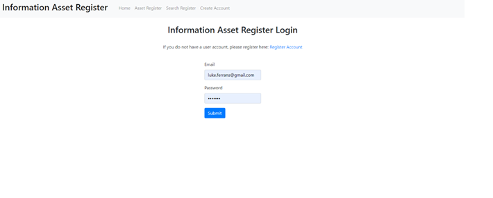
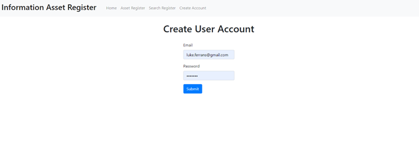
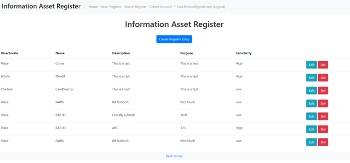
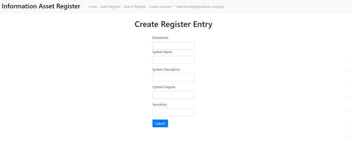
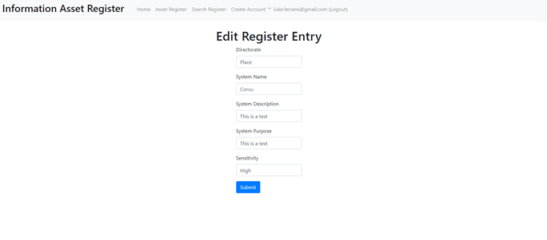

## January 21, 2022

# ASSESSMENT

**ADVANCED DATABASE SYSTEMS (COM519)**

**GitHub:** [**https://github.com/LukeFerrans/AdvancedDB**](https://github.com/LukeFerrans/AdvancedDB)

**Heroku:** [**https://arcane-spire-43770.herokuapp.com/**](https://arcane-spire-43770.herokuapp.com/)

# LUKE FERRANS

SOUTHAMPTON SOLENT UNIVERSITY

Student Number: 15036481

# Contents

[Introduction 3](#_Toc93661538)

[Design Decisions 3](#_Toc93661539)

[Schema 1 – Register 3](#_Toc93661540)

[Schema 2 – Directorate 4](#_Toc93661541)

[Schema 3 – Sensitivity 4](#_Toc93661542)

[Schema 4 – User 4](#_Toc93661543)

[Data Storage 4](#_Toc93661544)

[Security 4](#_Toc93661545)

[System Overview 5](#_Toc93661546)

[Home Page 5](#_Toc93661547)

[Register Account 5](#_Toc93661548)

[Asset Register 6](#_Toc93661549)

[Create Entry 6](#_Toc93661550)

[Edit Registry Entry 7](#_Toc93661551)

[Conclusion and Reflection 7](#_Toc93661552)

[Improving the application 8](#_Toc93661553)

[Conclusion 8](#_Toc93661554)

# Introduction

Over the course of the last 12 weeks I have been learning about NOSQL or Schemeless databases and how they can be deployed by using a mixture of HTML and EJS with the aim so solve a particular problem ensuring to incorporate CRUD (Create, Read, Update, Delete) operations.

Working at Southampton City council (or any council for that matter) as you can imagine there's no shortage of data problems to solve, but the data we hold and the restrictions surrounding how data can be handled and used are quite strict, and for good reason, as it mostly contains information about our customers - so for that very reason I've chosen to work on something that contains no sensitive information and instead tracks our internal systems and databases, the Information Asset Register.

An information Asset Register in itself is a rather simple document containing a list of databases, who owns them, the purpose of those databases and the sensitivity of the data held. Every local Authority is required to keep one and they are inspected annually.

Southampton City Councils Asset Register is kept on a spreadsheet, in a folder, on a network drive and this is where the problem lies. When it comes to updating the spreadsheet it is often accessed by multiple people and sometimes multiple copies are emailed around departments to be updated, then these files are merged. This doesn't always work… Several versions of the same document are then left sometimes with contradictory or out-of-date information with no one knowing which one is the master document. So, for this assessment I propose that I set up a new process to store the asset register in a centralised location making it much simpler to create or update new entries and hopefully eliminating any incorrect information.

_WC (296)_

# Design Decisions

As mentioned in the introduction to this assessment, the asset register is a simple document and I plan to keep it that way. There's no need to add any additional complexity.

The Asset Register will require 4 schemas listed below.

## Schema 1 – Register

Will store the information for the asset register itself.

| **Column** | **Description** | **Data Type** |
| --- | --- | --- |
| Directorate | The Directorate the system belongs to | String |
| --- | --- | --- |
| Name | Name of the system | String |
| Description | Brief descrition of the system | String |
| Purpose | What the system is used for | String |
| Sensitivity | How sensitive the information in the system is | String |

## Schema 2 – Directorate

Will store the names of each directorate. This can then be used in drop-downs when creating or updating entries, lessening data errors.

| **Column** | **Description** | **Data Type** |
| --- | --- | --- |
| Directorate | Name of the Directorate | String |

## Schema 3 – Sensitivity

Again, stores the names of each sensitivity (High, Medium, Low etc.) for use in dropdowns.

| **Column** | **Description** | **Data Type** |
| --- | --- | --- |
| Sensitivity | Name of the Sensitivity | String |

## Schema 4 – User

Stores login information for user accounts. Used for authentication.

| **Column** | **Description** | **Data Type** |
| --- | --- | --- |
| Email | Email of user | String |
| --- | --- | --- |
| Password | Password of user | String |

## Data Storage

Data storage will be carried out in MongoDB, a NoSQL database (or document store) with the ability to upload files to create a collection, and these collections don't have schemas in the normal sense as they're created on the fly making the database extremely scalable.

## Security

A simple version of user authentication will be applied to the website requiring users to have registered an account and log in to the website before any amendments can be made to the data. The account information will be passed to MongoDB for storage and the password will be encrypted via a hash algorithm (MD5) and bycrypt. Hash to convert the passwords into an unrecognisable string and bycrypt to add additional layers of security such as salting protecting those hashed passwords from brute force attacks and also being looked up in a table.

_WC (233)_

# System Overview

## Home Page
Users land here and are prompted to login or, if they do not have an account to click on the 'Register Account' link.



## Register Account
The user is able to add their account details here and on submit are taken back to the login screen to log in.

 


## Asset Register
With the user logged in they are then directed to the Asset Register where they are able to Create, Read, Update and Delete records. Note the header, this is a common header persistent across all pages, but not contains the logged in users email and a logout prompt.

 

## Create Entry
On clicking the 'Create Registry Entry' button users are directed to the create entry page, where they can add another Registry Entry.

 


## Edit Registry Entry
Similar to the create entry page, however the form is pre-filled with the registry entry the user wishes to edit.

 


_WC (136)_

# Conclusion and Reflection

One thing is clear, I'm not a full stack developer! But in all seriousness, I'm definitely a step closer. I went into this project having never written Embedded JavaScript and being a stanch SQL developer, NoSQL databases just didn't seem right to me. Now, having troubleshot many an issue writing this application I understand (for the most part) how the application hangs together and NoSQL is a revelation.

First the scalability of a NoSQL database. Being able to import large or numerous documents without having to worry about if it will fit within the current schema is already an eye opener. Then there's the adaptability of not needing to create a table without first working out if all the datatypes will fit and when they inevitably don't, dropping and recreating the table… I will definitely be considering NoSQL in the future.

Application wise there were definitely a few road blocks along the way and a few things I would have liked to achieve but was unable to due to time constraints more than anything else, the first being drop downs. I understand how to list all of the data from a collection using the below as an example, which in SQL terms is essentially a 'Select * from' but was unable to call in the ejs from the controller.

```
constEntries = awaitRegister.find({});
```

The second being the search function. For quite some time I was troubleshooting everything and anything as I just couldn't work out why the web browser couldn't see my script.js file. At first I though it was a permissions issue, so checked that and all was fine. Then I thought perhaps it was because of where the file was stored, so moved to several different directories and nothing, it was only then after a lot of googling I read about the static path and saw that I had it incorrectly set, and, after setting it to the below the '404 could not find' error disappeared, but unfortunately I didn't have the time to properly implement…

```
app.use(express.static(path.join(__dirname, 'public')));
```
## Improving the application

I think for the most part, the application does what it needs to do but I would have liked to add a bit more in the ways of security. First, just allowing a user to create an account doesn't really work in the sense that anyone could create one. I would hide the join screen behind the authentication middleware and have new users instead fill out a web form which would be emailed to in inbox, then an authenticated user could set up the account for them.

A password reset service is also something I considered, but realise it was probably a bit beyond me at the moment but definitely possible given the amount of resources online e.g.

https://betterprogramming.pub/build-a-login-system-in-node-js-f1ba2abd19a

## Conclusion

In terms of the application brief I would say the application solves the problem outlined in the introduction. It centralises the information asset register reducing the duplication caused by multiple copies and only allows trusted users to access it. The application also meets the CRUD requirements, giving users the ability to Create, Read, Update and Delete records from the Information Asset Register.

_WC (514)_

_Total WC (1179)_